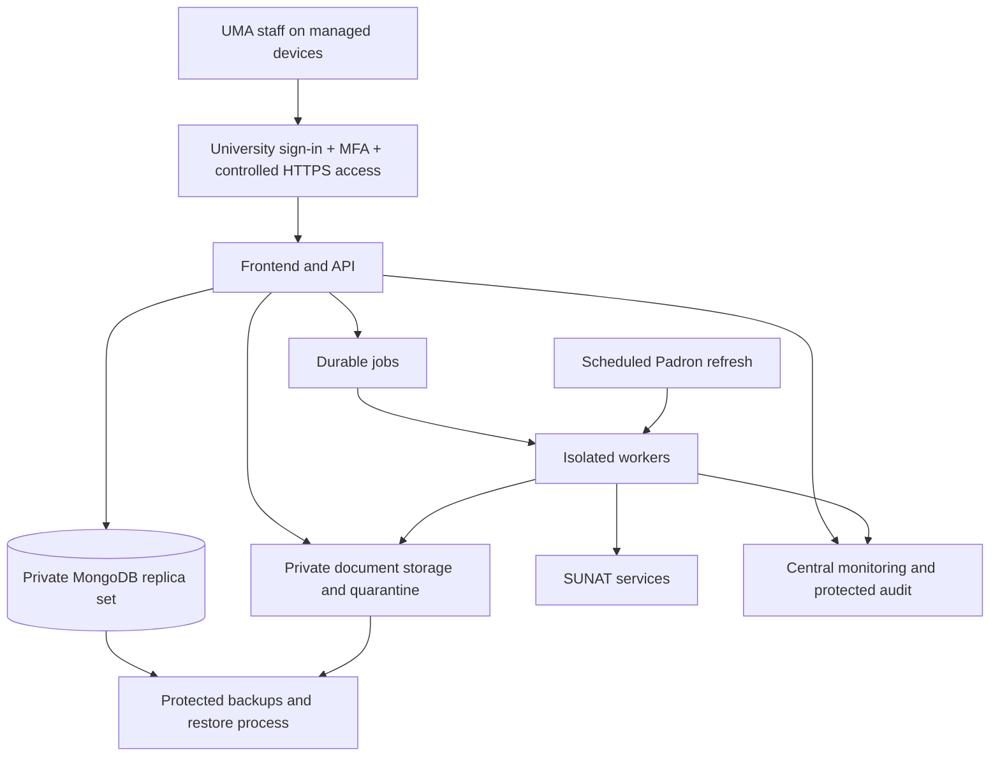

# UMA finance: security and deployment review

Assessment date: 8 September 2026. Reviewed repository revision: `f6dd2c0`.

## Decision

Do not use the current configuration for live university finance operations yet. The application has useful security controls, but the findings below require remediation and release validation. Deploying the same code to a reputable cloud provider will not fix application authorization or financial-control defects.

This review examined authentication, permissions, financial workflows, suppliers and bank accounts, uploads and exports, SUNAT integrations, storage, backups, startup and deployment configuration, dependencies, and automated tests. It combined source inspection with synthetic checks and the existing test suites. It is not an independent penetration test, a review of a live cloud account, or a compliance certification. No application code or live financial records were changed, and no deployment was performed.

The hosting proposal assumes an internal staff application. UMA's existing cloud contracts, identity provider, concurrent users, availability requirements, budget, and approved data locations have not been confirmed.

## Evidence from this review

| Check | Result | Interpretation |
| --- | --- | --- |
| Backend test suite | 140 tests: 126 passed, 14 failed | Failures include invoice requirements, quotation/workflow expectations, and the financial lifecycle. Triage outdated tests versus defects; these are not automatically 14 security vulnerabilities. |
| Frontend contract test suite | Passed | Does not establish end-to-end authorization, accessibility, or production browser security. |
| `npm audit --omit=dev --json` | 15 affected packages: 1 critical, 7 high, 7 moderate | Includes build/install dependencies because of the workspace dependency layout. Assess reachability and upgrade safely. |
| Synthetic department access check | A director could pass the request visibility helper for another department | Approval decisions have department checks, but viewing is broader. |
| Synthetic generated-report access check | Access was permitted on role alone without loading a generated-file record | The download policy does not establish which records the caller may see. |
| Synthetic export path calculation | A user-controlled period could resolve outside the reports directory | No file was written by this check; actual write impact remains bounded by the process permissions and filename construction. |
| Synthetic CSV check | A formula-like text value remained executable spreadsheet syntax | Quoting alone does not neutralize formulas. |
| Synthetic SUNAT validation check | Shared validator returned success while `voucherVerified` and `authoritative` were false | Invoice verification and taxpayer verification need separate enforced outcomes. |

Detailed command output is retained locally in `.tmp/security-review/backend-tests.txt`, `.tmp/security-review/frontend-tests.txt`, and `.tmp/security-review/npm-audit-production.json`. Temporary output may be ignored by Git; preserve it securely with release evidence if required.

## Controls already present

- Password hashing, authenticated routes, server-side role checks, and a login attempt limiter.
- Protected requests reload the current user and check whether the account is active; deactivation therefore affects subsequent authenticated requests.
- Public registration is disabled when `NODE_ENV=production`.
- Helmet/CSP configuration, production origin restrictions, protected download routes, and download path normalization.
- Upload type/size checks, basic file signature checks, randomized filenames and checksums; XML entity restrictions and ZIP processing limits.
- Workflow states, some concurrency/version controls, normal self-approval prevention, approval snapshots, and application-level append-only audit hooks.

Preserve these controls while addressing the gaps. Their presence does not compensate for the specific inconsistencies below.

## Priority 0: release blockers

### SEC-01 — JWT signing key tracked in Git

The repository tracks `.uma-local-jwt-secret`; the batch launcher reads this file into `JWT_SECRET`. Secret contents were not displayed in this review. If this key has been used in any shared environment, treat it as exposed. Possession of the active signing key can undermine token authenticity.

Rotate the key for every environment that used it and invalidate associated sessions. Remove the secret from the tracked tree, add an ignore rule and secret scanning, and coordinate removal from Git history and any distributed copies. History cleanup is not a substitute for rotation. Store deployment secrets in a managed vault with restricted access.

Evidence: tracked-file inventory and [startup script](C:/Users/TI-SJL-0010/Downloads/finance-main-triple-track-updated/finance-main/START_UMA_PUBLIC_FIXED.bat:360).

### SEC-02 — Demo access and production bootstrap are not separated

The login page always exposes demo role accounts and a shared demo password. The launcher runs the demo seed on an empty user database. Whether those accounts currently exist in a deployed database was not checked.

Remove demo shortcuts and credentials from production assets. Separate sample-data seeding from a production administrator bootstrap. Disable or replace seeded accounts before importing real data; create individually assigned identities through a controlled onboarding process. Production startup must reject demo/mock configurations for enabled financial capabilities.

Evidence: [login page](C:/Users/TI-SJL-0010/Downloads/finance-main-triple-track-updated/finance-main/frontend/src/pages/Login.jsx:10), [startup seed](C:/Users/TI-SJL-0010/Downloads/finance-main-triple-track-updated/finance-main/START_UMA_PUBLIC_FIXED.bat:512).

### SEC-03 — Department visibility is inconsistent

The request visibility helper and request listing give Approver users access to non-draft requests without the department restriction used for approval decisions. Saved report listing is broader than fresh report generation, and generated-file downloads check role rather than record ownership or department. Synthetic checks confirmed the helper behavior; this review did not access another person's real data.

Finance must approve a role/department/cost-center permission matrix. Enforce it in a shared server policy across lists, details, dashboards, searches, attachments, saved exports, and downloads. If a role intentionally needs university-wide visibility, encode that permission explicitly. Add negative tests for cross-department and direct-link access.

Evidence: [request visibility](C:/Users/TI-SJL-0010/Downloads/finance-main-triple-track-updated/finance-main/backend/src/utils/permissions.js:45), [file access](C:/Users/TI-SJL-0010/Downloads/finance-main-triple-track-updated/finance-main/backend/src/services/fileAccessService.js:56), [saved reports](C:/Users/TI-SJL-0010/Downloads/finance-main-triple-track-updated/finance-main/backend/src/controllers/reportController.js:315).

### SEC-04 — Financial operations can silently lose transaction protection

`runFinancialOperation` proceeds without a database transaction when transaction support is unavailable or its detection fails. The batch launcher starts standalone MongoDB, without replica-set configuration or authentication options, and publishes its port. External reachability depends on the host network and firewall and was not established.

Use an authenticated, private, TLS-protected MongoDB replica set, normally a managed service. Refuse financial writes in production when transactions cannot be established. Check transaction coverage across budgets, purchase orders, invoices, payables, journals, and payment status changes. Add durable idempotency, unique constraints and concurrency checks where required; a transaction by itself does not prevent duplicate business operations.

Evidence: [transaction fallback](C:/Users/TI-SJL-0010/Downloads/finance-main-triple-track-updated/finance-main/backend/src/services/transactionService.js:16), [MongoDB startup](C:/Users/TI-SJL-0010/Downloads/finance-main-triple-track-updated/finance-main/START_UMA_PUBLIC_FIXED.bat:225).

### SEC-05 — Independent financial authorization is incomplete

The bank-account creation and verification paths permit the same Accounting/Admin actor to perform both actions. Treasury permissions also allow one actor to perform multiple payment stages. Normal request self-approval is blocked, but an Admin exception with a reason exists. These are insider-fraud and account-compromise risks even when login works correctly.

Require separate named people for bank-account entry and approval, and payment preparation and authorization. Verify changes through a previously trusted supplier contact. A changed destination must trigger renewed approval, preserve the approved account version in the payment snapshot, and generate an alert. Define amount limits, restricted emergency overrides, and independent reconciliation. Separate IT administration from routine finance approval. Enforce these rules in the API and at the bank portal.

Evidence: [bank-account creation and verification](C:/Users/TI-SJL-0010/Downloads/finance-main-triple-track-updated/finance-main/backend/src/services/supplierService.js:622), [payment confirmation](C:/Users/TI-SJL-0010/Downloads/finance-main-triple-track-updated/finance-main/backend/src/services/treasuryService.js:473).

### SEC-06 — Taxpayer validation can be treated as invoice success

The public Padrón provider returns `valid: true` for an eligible issuer while explicitly returning `voucherVerified: false`, `authoritative: false`, and a status explaining that the CPE was not validated. The shared validator uses the `valid` flag and can return success; invoice registration can then mark the voucher `VALID`. This does not demonstrate that a fabricated invoice has passed every workflow check, but it confirms a missing verification gate.

Separate issuer eligibility, XML consistency, and official invoice verification. An unverified invoice must remain pending or follow a separately authorized, evidenced manual verification process. Configure and test the actual production verification service before treating CPEs as officially accepted.

Evidence: [Padrón voucher result](C:/Users/TI-SJL-0010/Downloads/finance-main-triple-track-updated/finance-main/backend/src/integrations/sunat/PublicPadronSunatProvider.js:328), [shared validator](C:/Users/TI-SJL-0010/Downloads/finance-main-triple-track-updated/finance-main/backend/src/services/sunatVoucherService.js:32), [invoice gate](C:/Users/TI-SJL-0010/Downloads/finance-main-triple-track-updated/finance-main/backend/src/services/invoiceRegistrationService.js:213).

### SEC-07 — Report filename construction allows directory escape

An unvalidated query period enters the generated CSV filename and is joined directly to the report directory. A synthetic path calculation escaped that directory. This is a write-path issue; the separate download normalization does not fix it.

Validate supported period formats and ranges. Generate server-owned filenames independent of user input and verify that resolved output paths stay within the intended storage root. Test rejected traversal inputs without writing outside a disposable test directory.

Evidence: [filename construction](C:/Users/TI-SJL-0010/Downloads/finance-main-triple-track-updated/finance-main/backend/src/controllers/reportController.js:307), [file persistence](C:/Users/TI-SJL-0010/Downloads/finance-main-triple-track-updated/finance-main/backend/src/services/exportService.js:31).

### SEC-08 — Real bank batch formats are not implemented

The bank integration currently supplies demo adapters and labels its output as not certified. Selecting a non-demo mode throws an error instead of enabling a production adapter.

Obtain the selected banks' approved specifications, implement the adapters, complete bank acceptance testing, and verify duplicate handling, authorizers and reconciliation. Until then, disable live bank-file functionality. A limited internal workflow pilot could use a separately approved manual banking procedure; it must not imply bank integration is operational.

Evidence: [bank integration](C:/Users/TI-SJL-0010/Downloads/finance-main-triple-track-updated/finance-main/backend/src/integrations/banks/index.js).

## Priority 1: production hardening

| ID / area | Current finding | Required treatment |
| --- | --- | --- |
| SEC-09: identity and sessions | JWTs are in browser localStorage, default lifetime is eight hours, and logout removes client state without revoking the token. No MFA/SSO or general session revocation was found. | Use UMA's identity provider with MFA, named accounts and prompt offboarding. Prefer a same-origin server session using HttpOnly, Secure, SameSite cookies, with CSRF protection. Implement idle/absolute timeouts, session revocation and reauthentication for sensitive changes. Cookies do not remove the need to prevent XSS. |
| SEC-10: sensitive browser data | Request drafts persist in localStorage separately from logout. | Define shared-device rules, clear protected drafts on logout, and prefer authorized server-side draft storage. Use managed, encrypted, patched staff devices with screen locks and endpoint protection. |
| SEC-11: spreadsheet exports | Backend and frontend CSV escaping does not neutralize formulas supplied through text fields. | Neutralize formula-leading text safely, or produce typed spreadsheet cells. Test both export paths while preserving legitimate numerical amounts. |
| SEC-12: file safety and exhaustion | Existing type, signature and size checks do not scan malware. Individual limits can still allow large aggregate uploads. | Quarantine and scan files before processing or release, restrict executable/macro-bearing formats, bound nested archive expansion and parsing, set total quotas/concurrency/rate limits, and clean abandoned temporary files. |
| SEC-13: storage and privacy | Documents and generated files use local directories and some persisted absolute paths. No application field encryption for supplier banking fields was found; infrastructure encryption was not reviewed. | Use private durable storage, encryption in transit and at rest, authorized downloads, restricted short-lived links, retention rules, and masking. Consider field encryption for selected bank/identity data with managed keys. Adapt the file interface and migrate stored paths. |
| SEC-14: audit integrity | Mongoose hooks restrict audit modification, but a privileged database user can bypass them. The audit IP code reads forwarded headers directly. | Export events to independently controlled append-only storage; restrict log deletion, trust only configured proxies, and redact secrets and unnecessary personal data. Capture failed sign-ins, privilege changes, banking changes, sensitive exports and overrides. Ensure completed transactions produce durable audit events. |
| SEC-15: dependencies | Audit found 15 affected packages, including critical `tar` through bcrypt's installation dependency chain. | Triage runtime versus build/install exposure, update deliberately, scan containers and browser dependencies, and establish patch ownership. Do not apply forced major upgrades without compatibility and workflow tests. |
| SEC-16: availability and SUNAT | Padrón initialization is awaited before the API listens. Refreshes, browser automation and financial requests share application resources. | Move Padrón refresh and browser work to isolated jobs/workers. Keep validated versioned snapshots and show freshness. Bound retries, concurrency and resources; prevent worker egress to internal/metadata endpoints. External website availability must not determine whether staff can open the platform. |
| SEC-17: backup and recovery | The local script exports collections sequentially and copies documents to the same host. It is not a consistent, independent recovery system. | Configure continuous database backup and point-in-time recovery plus document versioning and protected backups, separate privileges, approved-region recovery copies, and measured restore drills. Protect keys/configuration too. |
| SEC-18: monitoring and production ingress | `/health` is a static success response; production proxy trust is fixed at one hop. Login limiting is local to the process. | Add database readiness, job/queue/storage checks, bounded shared rate limits, HTTPS-only ingress and an explicit proxy trust model. Keep database ports and application origin private. Configure alerts with named responders. |
| SEC-19: releases and ownership | No production container packaging, infrastructure code or CI workflow was found. The Render definition points a static access service at a temporary Cloudflare tunnel. | Establish institution-owned repository/cloud/domain access, protected releases, isolated staging, reproducible builds, secret/dependency scanning, rollback procedures and at least two accountable administrators. |

Useful source references: [session storage](C:/Users/TI-SJL-0010/Downloads/finance-main-triple-track-updated/finance-main/frontend/src/context/AuthContext.jsx:32), [CSV export](C:/Users/TI-SJL-0010/Downloads/finance-main-triple-track-updated/finance-main/backend/src/services/exportService.js:1), [local storage service](C:/Users/TI-SJL-0010/Downloads/finance-main-triple-track-updated/finance-main/backend/src/services/storageService.js:9), [backup script](C:/Users/TI-SJL-0010/Downloads/finance-main-triple-track-updated/finance-main/backend/scripts/backupLocalData.js:11), [existing Render definition](C:/Users/TI-SJL-0010/Downloads/finance-main-triple-track-updated/finance-main/render.yaml).

Audit nuance: the dependency findings include Express/body-parser, routing packages, Vite/build dependencies and fast-xml-parser. The XML advisory concerns a builder path; the reviewed application uses XMLParser, so its applicability requires reachability analysis. An audit severity is not proof of exploitability in this application. Conversely, a clean dependency audit would not establish application security.

The application's actor/timestamp sign-off and checksum records should be described as internal approval evidence. They are not, by themselves, a certificate-based digital signature; obtain legal review if official digital-signature status is required.

## Deployment recommendation

Prefer the cloud UMA's IT team already supports. If UMA uses Microsoft 365/Entra ID, my first proposal is Azure Container Apps with MongoDB Atlas and private document storage. This keeps the current React/Express/MongoDB stack while replacing workstation operations with managed infrastructure. If UMA already supports AWS, ECS/Fargate with Atlas and S3 is a reasonable equivalent. Existing institutional skills, contracts and incident response are more important than adding a new cloud brand.

### Proposed Azure components

| Component | Proposed responsibility |
| --- | --- |
| Institutional identity provider | Staff sign-in, MFA, account lifecycle and privileged-access policy. |
| Controlled HTTPS access | For this internal app, prefer university VPN or identity-aware private access. If public ingress is necessary, use a protected gateway/WAF and restrict access to the underlying origin. |
| Container Apps | Serve the built frontend and API under one origin; run separately controlled workers. |
| Dedicated MongoDB Atlas deployment | Transaction-capable database, private connectivity, restricted application credentials and managed recovery. |
| Private Blob Storage | Original evidence and generated documents through an application storage adapter, with quarantine, access checks and retention. |
| Scheduled job and worker queue | Padrón refresh, bounded SUNAT lookups and long-running financial processing with durable job state. |
| Key Vault, managed identities and monitoring | Secret control, service permissions, operational telemetry and alerts. |
| Independent backup and audit storage | Recovery and investigation access separated from routine application administration. |

Microsoft documents network isolation, identity, vault integration and production security controls for [Container Apps](https://learn.microsoft.com/en-us/azure/container-apps/secure-deployment). Atlas private endpoints require dedicated clusters; they are unavailable on Free and Flex tiers. Confirm supported region, cluster sizing and backup features before procurement. [Atlas private endpoints](https://www.mongodb.com/docs/atlas/security-private-endpoint/)

This architecture requires application changes. Default container filesystems are temporary; mounting persistent Azure Files is one migration option, while Blob Storage requires an API adapter rather than being treated as a local directory. Windows absolute paths must be migrated. [Container Apps storage](https://learn.microsoft.com/en-us/azure/container-apps/storage-mounts)

Padrón refresh can run as a scheduled cloud job independent of a user opening the BAT file. Configure overlapping-run protection, atomic snapshot publication, failure alerts and consistent cache invalidation. Container Apps scheduled jobs use UTC cron schedules. [Scheduled jobs](https://learn.microsoft.com/en-us/azure/container-apps/jobs)

Before running multiple API replicas, externalize local files, shared rate-limit state, job ownership and cache generations; verify concurrent operations. Use multiple replicas and supported redundancy if the approved availability target requires them. Load-test with realistic simultaneous staff activity, bulk invoices and Padrón refreshes before selecting capacity.

For AWS, use private tasks behind a controlled load balancer rather than directly exposing each application task. [AWS ECS exposure guidance](https://docs.aws.amazon.com/securityhub/latest/userguide/exposure-ecs-service.html)

On-premises deployment is viable only if university IT can operate dedicated servers, redundant storage/power, secure remote access, patching, monitoring, recovery and incident response. An employee PC, a public tunnel or the existing static Render access page is not that operating model.

Costs must include application/worker compute, a database tier with required security/recovery features, document storage and backups, scanning, networking/private endpoints, identity licenses, retained logs, staging and operational support. Obtain a current quote after workload and region decisions; no price or service-level commitment is established by this report.

## Privacy and recovery decisions

UMA should have its privacy/legal team review Law 29733 and D.S. 016-2024-JUS: processing purposes, relevant data-bank registration, retention, access rights, processor contracts and international transfers. Cross-border hosting needs an assessed legal basis and safeguards; do not assume all data must remain in Peru or that any foreign region is automatically acceptable. Article 34 requires ANPD notification within 48 hours for qualifying incidents, with affected-person notification in applicable circumstances. Assess the facts with counsel and document an incident procedure. [Official regulation](https://www3.congreso.gob.pe/Docs/DGP/DIDP/files/ds_016-2024-jus.pdf), [ANPD registration guidance](https://www.gob.pe/9251-modificar-banco-de-datos-en-el-registro-nacional-de-proteccion-de-datos-personales)

Approve a data inventory covering employee identities, reimbursements, supplier contacts and accounts, invoices, bank files, approval histories and uploaded evidence. Include logs, browser debug captures, replicas, support access and backups in location and retention decisions. Tracked SUNAT debug HTML/screenshots should be reviewed and removed from routine production repositories; use synthetic fixtures for tests.

Proposed recovery objectives for discussion: no more than 15 minutes of recoverable data loss (RPO), and restoration within four hours (RTO). These are targets, not measured capabilities or vendor guarantees. Finance must decide what is acceptable during payroll, payment runs and period close. Atlas supports continuous backup and point-in-time recovery when appropriately configured. [Atlas recovery architecture](https://www.mongodb.com/docs/atlas/architecture/current/disaster-recovery/)

Restore exercises must recover the database, indexes, document versions, keys and configuration together, then reconcile totals and document checksums. Database replication is not a backup. A database rollback after an actual bank payment can recreate apparent unpaid invoices; reconcile with the bank before enabling payment processing after recovery.

## Deployment process and acceptance gates

### 1. Establish institutional ownership

Assign accountable owners in Finance, IT and privacy/security. Confirm identity provider, departments/roles, concurrent users, operating hours, data locations, retention, bank procedures, support contacts and recovery targets. Use institution-owned source control, domain, cloud subscription and billing, with MFA and controlled emergency access. Deliverable: signed permission matrix and operating requirements.

### 2. Remediate and verify the application

Resolve SEC-01 through SEC-08 and production requirements in SEC-09 through SEC-19. Investigate the 14 failing backend tests; fix actual defects and correct obsolete assertions with justification. Add meaningful negative authorization, independent-approver, duplicate-payment, concurrency and transaction-failure tests. Upgrade affected dependencies through reviewed changes. Deliverable: passing relevant tests and a documented vulnerability disposition.

### 3. Build repeatable deployment infrastructure

Create reproducible Linux container builds with pinned dependencies, compatible Playwright/Chromium runtime and non-root processes. Keep secrets, debug captures and customer data out of build contexts. Add a release pipeline with tests, secret/dependency/container scanning and reviewed production promotion. Provision isolated development, staging and production resources through infrastructure code. Deliverable: a clean staging deployment from the pipeline.

### 4. Rehearse migration and recovery

Create and verify a backup before migration. Separate real reference data from demo fixtures; map old document paths to durable object identifiers. Dry-run migration of supplier accounts, permissions, annual/monthly budgets, requests, commitments, invoices, payables and evidence. Check record counts, balances by currency/period, duplicates and checksums. Perform a full restore in isolation and measure it against the agreed targets. Deliverable: reconciliation and restore evidence accepted by Finance and IT.

### 5. Validate staging as a complete system

Use synthetic or properly anonymized data. Exercise every role and unauthorized-role combination, including direct attachment/export links. Test login, logout, deactivation, MFA, CSRF protection, uploads, malware quarantine, concurrency, retry-after-timeout, worker restarts, database interruption, stale SUNAT snapshots and storage exhaustion. Run bank acceptance tests before real bank-file use. Commission an independent security test before broad finance rollout, using applicable OWASP ASVS 5.0 Level 2 requirements as a verification baseline and extra attention to high-value transaction controls. [OWASP ASVS](https://owasp.org/www-project-application-security-verification-standard/)

### 6. Run a controlled staff pilot

Train a small named group from Finance, Accounting, Budget and Treasury. Confirm role ownership, support procedures and daily reconciliation. Enable only capabilities that passed their release gate; explicitly disable uncertified bank exports or unverified invoice automation. Record and resolve pilot issues. Deliverable: Finance acceptance for wider rollout.

### 7. Cut over with a financial reconciliation plan

Schedule a maintenance window, freeze old-system writes, take a final consistent backup, and migrate the final changes. Reconcile opening budgets, commitments, payables, accounts and documents before reopening. Configure the institutional domain, TLS, SSO and staff provisioning. Verify production readiness, permissions and alerts. Observe the first actual payment cycle with independent authorization and reconciliation. Retain the old system read-only for the agreed retention period.

### 8. Operate and maintain

Monitor failed logins, permission denials, bank-account changes, overrides, exports, processing failures, backup health and SUNAT freshness. Assign daily operational checks and regular patching, access reviews and restore drills. Prioritize exploited vulnerabilities immediately under an incident/patch policy. Review privileges on every role change or departure. Maintain a release rollback and incident runbook: reverting an application image must not silently revert financial records or erase completed bank activity.

## Go-live sign-off checklist

- [ ] Exposed signing keys rotated; production secrets isolated; demo access removed.
- [ ] SSO/MFA, session revocation and approved record-level permissions verified.
- [ ] Transactions, idempotency, concurrency and independent financial approvals tested.
- [ ] SUNAT verification states are accurate; only certified or explicitly controlled payment processes enabled.
- [ ] Report path issue and spreadsheet formula handling fixed; file scanning and private storage operational.
- [ ] Relevant test suites pass; dependency findings resolved or explicitly assessed and accepted.
- [ ] Staging migration, financial reconciliation, full restore and independent security review completed.
- [ ] University owners approve privacy, data location, access, support and recovery requirements.
- [ ] Monitoring, incident response, staff training and a controlled cutover are ready.

Recommended sequence: secure the application, prove it in isolated staging, complete a controlled finance pilot, then authorize wider production use.
